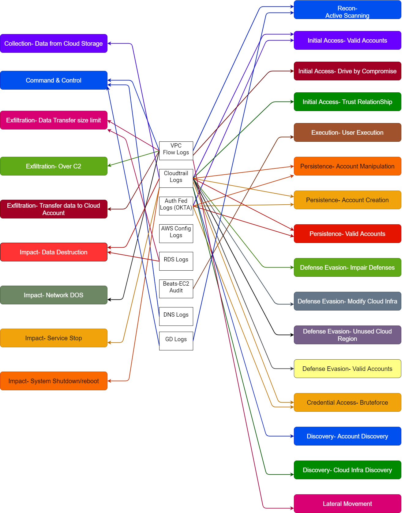
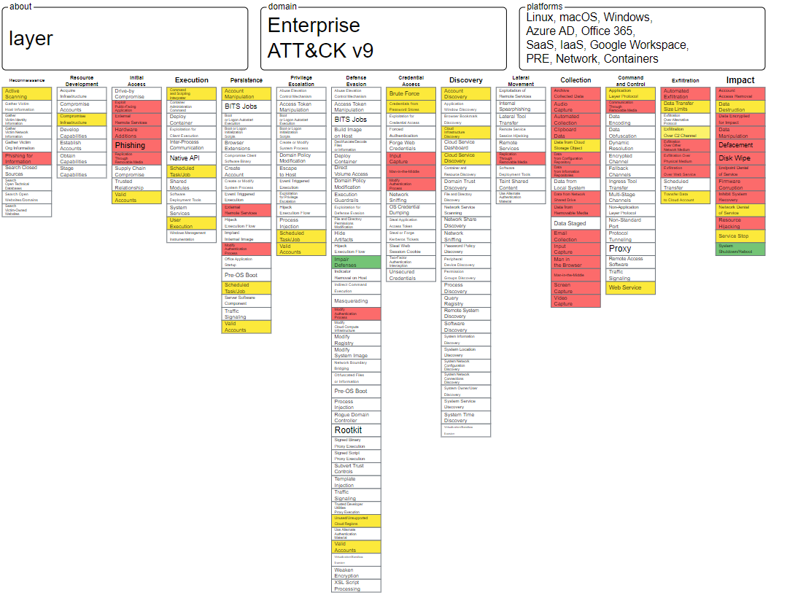

# Cloud-MITRE-Mapping
This has been created for them who wants to create Detection Usecases leveraging MITRE but don't know from where to start from.
* In return get me some subscribers for my YouTube Channel 👉 https://www.youtube.com/c/BlackPerl
* If you like to support my creation and pay me back a little, you can buy me a coffee ☕ https://www.buymeacoffee.com/BlackPerl

### How to use
* First Identify the Log Sources what you have in your network
* Open draw.io and import the Log Source- MITRE Mapping.drawio file to edit as per your need.
* Open Attack- Navigator and select new layer > Upload existing and import Cloud MITRE Mapping.json to start with. You can edit/remove as per your need. Once done, export the same as PNG/JSON/Excel what suits you best. If you want to get your inhouse Attack Navigator, follow this- https://youtu.be/LVcYOwLqW_Y
* Then start working on the Detection Usecases.

### Log Source- MITRE should look like this, once imported

  

### Cloud MITRE Mapping should look like this, once imported

  

